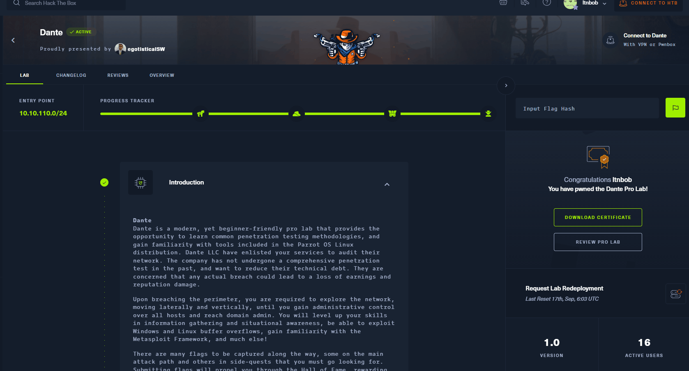
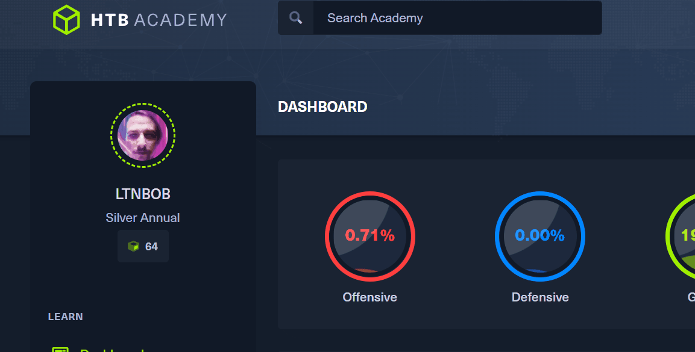

# Hack The Box Dante Pro Lab Review, Reflection & Resources

<figure><figcaption>
A complex playground - Made with Midjourney
</figcaption></figure>


My Video On Dante


Hack The Box's Dante Pro Lab is an awesome learning experience for those that want an in-depth understanding of penetration testing and insight on how attackers often approach enterprise network environments. In this review I will be sharing my thoughts, a few lessons learned, tools and why I think you should definitely try at least one of Hack The Box's Pro Labs.

I am a bit biased when it comes to Hack The Box because I absolutely love the platform and view them as the Apple (Jobs era) of Cybersecurity Training. For those who do not know what Hack The Box is, it is a company and website that creates intentionally vulnerable machines, challenges, lab environments and learning experiences to help anyone upskill in Cybersecurity subjects. Each piece of content they develop is accessible all from inside a browser, they even provide a browser-based VM called Pwnbox (based on Parrot OS) that learners can use to practice tactics, techniques and procedures. There are also options to connect to their hackable environments using your own personal VM and a VPN connection.

### What is Dante?

**Dante** is part of HTB's Pro Lab series of products. A Pro Lab is a vulnerable lab environment made up of multiple vulnerable VMs that are connected in a cohesive way modeling common real-life enterprise environments. Dante is made up of **14** machines & **27** flags. Each flag must be submitted within the UI to earn points towards your overall HTB rank and the Dante completion certificate.

<figure><figcaption>
Dante on Hack The Box
</figcaption></figure>

Each Pro Lab has a story behind it and is designed that way to give it a realistic feel and I can say Dante does feel like a real IT environment. I initially wanted to start with Dante because I had never done a Pro Lab before and I was seeing people share their completion on social media sites. Truthfully I was hesitant at first to even subscribe to Dante because it feels intimidating to learn this way. I felt the same way when I first started using Hack The Box to learn penetration testing skills because it requires much more active learning and humility to learn hands-on in my opinion. But I overcame that hesitancy and just dove in.

Please know that I can share some of the tools and insights from my experience working through Dante but I will not be sharing any solutions because I don't want to spoil the learning experience and it is against HTB's TOS to share Pro Lab solutions.

### Quick Thoughts on Using Pwnbox

I really like [Pwnbox](https://0xdf.gitlab.io/2020/08/04/htb-pwnbox-review.html) (browser-based VM) . My experience in working with it is consistently positive and I spent continuous hours working in it during my time working through Dante. I mostly used Pwnbox to complete Dante though I would occasionally use a personal VM on my network when I wanted to save tools (mostly Github repos) I was learning about in the process. The only downside is it does not have persistence (you can't save your progress or tools you installed). I also have peace of mind performing these techniques from another network.

### Lessons Learned

I learned so much working through Dante that I could probably write a book about it. Ill condense some of that here for the sake of everyone's time. Know that any learning resource I use I approach from a Security Researcher/Educator perspective. So I'm viewing learning resources as a researcher but also as an educator who will likely use the resource as a teaching tool in the future which brings me to my first lesson learned.

#### 1. Hands-on Learning is the Best Way to Learn

It would've been a whole lot easier for me to just read books & articles about subjects and try to live off theoretical knowledge but this approach isn't as impactful. Dante requires you to apply your theoretical knowledge. In other words I came across some web applications where I understood theoretically how I could exploit them but only practical application would prove if my theory was right. This isn't really a new lesson per say more so an active reminder. In all of the classes I teach I require my students to show me what they have learned in a variety of different lab configurations, but what I learned with Dante is that it is especially impactful and essential to learn hacking, security research & penetration testing skills by having an enterprise lab to practice on. I never once got bored during Dante because I was always intentionally researching with the goal of progressing further in the environment.

#### 2. Take Good Notes so you don't Need to Intentionally Memorize Everything

Memorization is important but **how** you memorize topics, concepts and tool usage is more important. For example, I could read the manual on the [Metasploit Framework](https://www.metasploit.com/) and try to memorize every single module, setting and option or I could use it in practical scenarios and memorize specific uses through repetition within the context of testing a target system. As I would use tools Id never really worked with before, I would keep my own personal cheat sheet. The cheat sheet isn't a book, it is more of a personal reference guide that can be organized based on what makes most sense to you. When I came across commands, web sites and one-liners that I felt myself wanting to try over and over I'd put it in my notes for easier reference and copy & pasting (you don't always need to type out the entire command every time). It also helped me "save my progress" when I needed to take a break. This is essential to progress through the lab and you can come up with your own note taking methodology as you go but I recommend always documenting what you did last and what you want to try next.

Practically, for each vulnerable target document the hostname and IP address followed by any enumeration results you've gathered. I didn't approach this as I would a penetration test report, but more so as a learning journal. You can also save any links to websites or learning resources you find during your research (yes you will be doing a lot of good research). As you take notes you will also learn at a deeper level. Think of it as Saving Your Learning Progress. Writing will help you develop a deeper understanding. I thought about providing a note taking template with this blog post but it is probably best if you develop your own and get creative with it. Doing Dante will provide endless opportunities to take notes on a wide variety of subjects and TTPs.

#### 3. Pivoting is Amazing

I had to swallow my pride on a few of the Pivots in Dante. I've taught beginner-advanced computer networking courses (at a Cisco Network Academy) for over 5 years in a hands-on lab environment and hit a few "walls" in Dante when trying to get a shell back 2 or more pivots deep in a network. At first I was blaming it on the lab environment thinking it needed to be reset or something but NOPE it was me. Even though I have a great understanding of computer networks, network/system administration and lots of topics in Cybersecurity I didn't understand pivoting at a deep level. For some reason I thought it should've just been easy for me but there are many different ways to Pivot, some ways work better than others depending on the target. Creating network diagrams and staring at them made me think about all the different ways to get to the subnet I wanted to get to. It also tested and grew my understanding of networking within a security context. I mainly used [https://app.diagrams.net/](https://app.diagrams.net/) to quickly put together a network topology. I recommend coming up with a pivoting strategy as soon as possible because as you move deeper into the network the way you pivot will determine your success in getting shells back :) . If you like computer networking the pivots in Dante are fascinating and a lot of fun.

#### 4. Leave No Stone Unturned

Look around on every machine you exploit. Though this will take more time and isn't as addictive as popping a shell, it is critical when searching for information that could help you gain access to more devices on the network. This is a phase often referred to as Post Exploitation. I recall having this constant temptation to hurry to the next machine so I could get a shell (getting shells is a great feeling) and that often made me overlook details and files I should've discovered at first. Leave No Stone Unturned, I promise you will not regret it and it will help you as you progress.

#### 5. Pro Labs are Good Professional Experience

This kind of vulnerable lab environment as a learning experience is invaluable. As soon as you finish you get a beautifully designed completion certificate.

<figure><figcaption>
Dante Completion Credential
</figcaption></figure>

Even more importantly, I noticed that I had an in-depth learning experience where I could talk about what I learned in great depth. I added it as a certification on my LinkedIn and learned from hiring managers in the industry that it is respected. My personal opinion is that more companies need to strongly consider putting Hack The Box's Pro Labs on their job descriptions because they really do provide a good learning experience and proof that candidates (especially in pentesting) have a demonstratable skillset. If you are looking for a job, you can use this kind of experience in the interview to show employers you have practical skills.

### Useful Learning Resources to Help With Dante

Dante was an excellent learning experience not only because of the hands-on challenge but also the research it will inspire. I recommend just start working your way through Dante and let the process guide your research and learning.

Here are some helpful tools that could help with Dante:

#### Free

#### HackTricks



#### PayloadsAllTheThings



#### Pivoting, Attacking The Unreachable Network by Plaintext



#### Pivoting with Chisel blog by Chisel



#### Tunneling with Chisel and SSF by 0xdf



#### Basic Network Pivoting by Achmadinata



#### ired.team by Mantvydas Baranauskas



#### IppSec's Website&#x20;

IppSec Rocks allows visitors to search a topic and automatically discover a IppSec walkthrough that covers the keyword used.&#x20;



#### IppSec's YouTube Channel



Hack The Box's Discord - Dante Pro Lab channel

#### Paid

#### Hack The Box Academy



#### Penetration Tester Job Role Path



#### HTB Academy Global Search&#x20;

I found HTB Academy's global search feature very useful during my time working through Dante. All I needed to recall was keywords and I could use that keyword to find all content related to the concept I wanted clarification on.

<figure><figcaption></figcaption></figure>

The following HTB Academy modules were especially helpful to me during Dante:&#x20;

**Hacking WordPress**

<figure><figcaption>
<strong>Hacking WordPress Module</strong>
</figcaption></figure>


Link to Hacking WordPress


**Shells & Payloads**&#x20;

<figure><figcaption>
<strong>Shells &#x26; Payloads Module</strong>
</figcaption></figure>


Link to Shells & Payloads


**Pivoting, Tunneling, and Port Forwarding**&#x20;

<figure><figcaption>
<strong>Pivoting, Tunneling &#x26; Port Forwarding Module</strong>
</figcaption></figure>


Link to Pivoting, Tunneling & Port Forwarding


**Using the Metasploit Framework**&#x20;

<figure><figcaption>
Using the Metasploit Framework Module
</figcaption></figure>


Link to Using the Metasploit Framework


**Active Directory Enumeration & Attacks**

<figure><figcaption>
Active Directory Enumeration &#x26; Attacks Module
</figcaption></figure>


Link to Active Directory Enumeration & Attacks


### Ways to Help & Support

You can help me continue to improve my content through feedback, words of encouragement and even if you:

 
