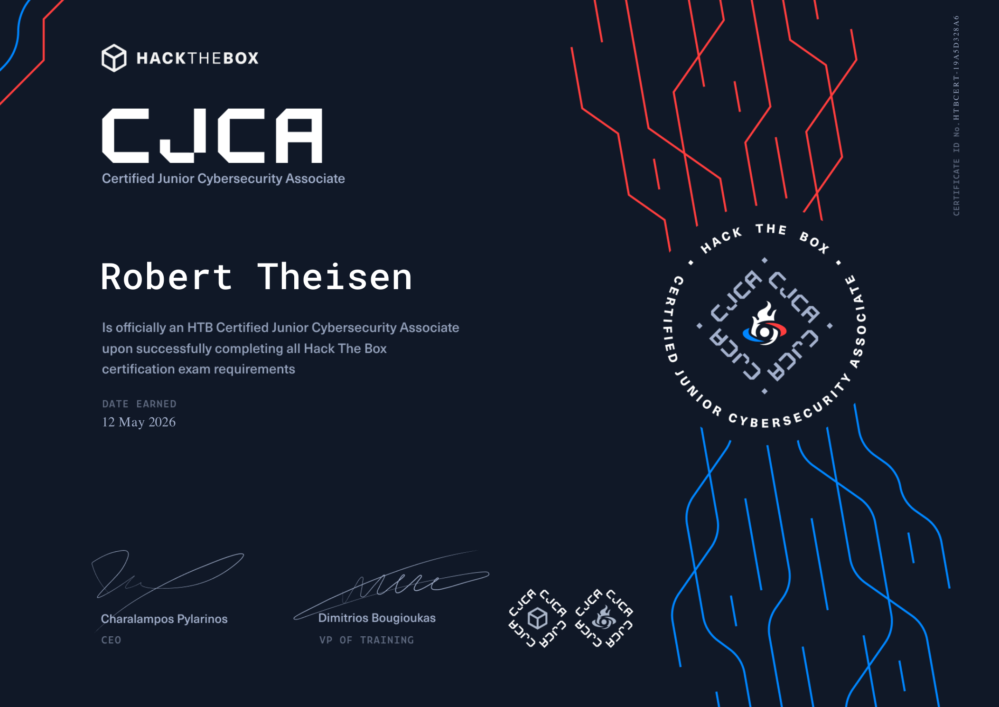

# I Passed HTB CJCA: Why Beginners Should Consider It

<figure><figcaption>
HTB Certified Junior Cybersecurity Associate credential earned on May 12, 2026
</figcaption></figure>

I also have to say that the certification art style is sick. It has a professional feel, but it still looks gamified, exciting, and genuinely cool to look at. Most other certifications look professional but bland, with little to no art direction. I love that HTB put this level of visual identity into the credential because it makes the achievement feel more memorable.

I recently passed Hack The Box's Certified Junior Cybersecurity Associate, also known as HTB CJCA, and I wanted to share a reflection on the experience. Not just because I earned the certification, but because I care deeply about helping beginners break into cybersecurity the right way.

One of the biggest struggles beginners face is finding high-quality, hands-on training that is structured, realistic, and flexible enough to fit into real life. There are plenty of certifications and study paths out there, but many of them lean heavily on theory. A learner can memorize concepts, pass a multiple-choice exam, and still feel unsure when asked to investigate a system, analyze activity, or work through a lab.

That gap is one of the reasons I chose CJCA.

I already work in IT and cybersecurity, so I did not approach this as a complete beginner. But I have helped enough beginners break into the field to understand how confusing the journey can be. There are many paths, many certifications, and many people giving advice. I wanted to go through CJCA myself so that the prep content I create through YouTube, blog posts, and live streams would be informed by someone who has actually passed the exam.


Hack The Box's introduction to HTB CJCA


## Why CJCA Stood Out To Me

<figure><figcaption>
Hack The Box Academy's Junior Cybersecurity Analyst path preview
</figcaption></figure>

The HTB Academy path stood out to me because of its on-demand nature. You can work through it on your own time and at your own pace, whether that means moving quickly or slowing down when a topic needs more attention. For me, that meant working through modules in the evenings after work. It is hard to put an exact number on how long the full process took, but that flexibility made it realistic.

The path covers a wide breadth of important topics: Windows and Linux fundamentals, networking basics, web penetration testing, network penetration testing, vulnerability assessment, common security frameworks, and cybersecurity paradigms. What I appreciated most is that CJCA covers many of the things you might only define at a surface level when studying for something like Security+, but then goes a step further by making you apply them.

That application matters.

It is one thing to know what enumeration means. It is another thing to sit in a lab, gather information, make decisions, test assumptions, and keep moving when the answer is not immediately obvious. That is where real skill starts to develop.

## What CJCA Covers Well

CJCA does a good job of giving beginners a broad, hands-on foundation. Learners get exposure to operating system fundamentals, networking, offensive security concepts, defensive security concepts, vulnerability assessment, and reporting. It is not just a collection of definitions. The Academy path regularly asks learners to apply what they are reading.

That is one of the most valuable parts of the experience. Beginners need repetition, context, and realistic practice. They need to see what it feels like to be uncertain, test an idea, fail, adjust, and eventually make progress. The on-demand format makes that much more doable because learners can return to difficult concepts, download cheat sheets, and build their own notes over time.

For someone who is trying to break into cybersecurity, that kind of practice can be a confidence builder. It helps learners move from "I recognize that term" to "I have used that skill in a lab environment."

## Where I Would Supplement The Path

I do think it is important to be honest about one area where I would supplement the path: networking.

The networking content is enough for the exam. You learn what you need to understand what is happening at a surface level in enterprise environments. But if you want a deeper understanding of real-world environments involving next-generation firewalls, switches, routers, and access points, I still strongly recommend building a foundation with Cisco's CCNA material.

That is not a knock against CJCA. It simply means CJCA has a scope, and deeper networking deserves its own serious study. The networking content in CJCA is good enough to help you understand what is going on at a basic level, but real-life enterprise networking can get much deeper.

## My Exam Experience

The exam itself felt fair and aligned with the training. It was challenging, but very doable. It encourages creative use of the skills you learned without going outside the scope of the path. If you are used to multiple-choice exams, though, the format may feel intimidating. Instead of picking from answer choices, you are dropped into a lab environment and expected to use your hard-earned skills.

Even with my experience, I felt intimidated before hitting the start exam button. I overthought it for a while until one evening I finally decided to jump in.

The exam gives you five days to reach the required score by capturing flags through penetration testing challenges, completing blue-team focused tasks, and submitting a report. The blue-team side flexes your threat hunting abilities and asks you to think like a hacker from a defender's perspective. I went in with my notes and the cheat sheets I had downloaded from each module. I also felt a boost of courage knowing I had a retake available if I failed.

During the exam, you are given a scope for the engagement that clearly defines what targets you need to attack and what systems you need to access for the blue-team side. That structure is helpful because you are not guessing what is fair game. You are still responsible for figuring out how to complete the objectives, but the boundaries are clear. I also want to be careful here: I cannot get into specific attack paths or exam solutions because that would spoil the experience and go against the spirit of the certification.

After submitting the report, an HTB staff member reviews and grades it. They also provide feedback, pass or fail. Thankfully, I passed on my first attempt, but I found it encouraging to know that if I had failed, I could have used their advice to direct my studying and prepare for success on the next attempt. During the waiting period after submitting my report, I continued studying toward HTB's Certified Offensive AI Expert, or COAE, which is their AI-focused certification.

That matters because failure is part of learning. In this industry, failures are data. They are lessons that help you succeed later. Obviously, the goal is to win and pass, but sometimes you can turn a failure into a win by turning the L into a lesson.

I completed the exam and submitted the report in about three days. Not three full days, and not three full business days. Realistically, I probably spent around 8 to 12 hours of focused work to reach a passing state, including the report. Some people may see that as fast, and others may see it as slow. But honestly, it does not matter. Your learning journey is your learning journey.

Difficulty is relative to your experience. You get faster and better the more you practice.

## The Habit That Matters Most

The best first habit a beginner can develop is simple: just do it. Make the time. Say no to other things when you need to study.

During my CJCA prep, I had to say no to Crimson Desert several times because I love the game and can easily let it pull me in for hours. I also know myself well enough to recognize the pattern of gaming deeply, stopping, and then scrolling my phone afterward.

When I switched into study mode, I had to remind myself that if I was not studying for the exam or working toward my goals, I was wasting time I had already decided mattered.

That does not mean you should never have fun. You should absolutely still have fun. But success requires sacrifice. A less dramatic way to say it is this: the habits and tasks that move you toward success need actual slots of time in your schedule. If your schedule is too full of everything else, you may need to be honest with yourself about how badly you want the outcome.

From a career and financial growth perspective, making time for your goals can put you in a position where you can afford more fun later, and at a higher level. Looking back, many of the sacrifices feel minor compared to what you become as you accomplish goals and build momentum.

That is one side effect of passing CJCA that I really value: it helped accelerate my learning momentum. You need that throughout your career, no matter how successful you become.

## Who Should Consider CJCA?

I recommend CJCA for all experience levels, but especially for beginners. It helps train you to crave difficulty, hands-on practice, and practical skill development instead of only chasing theory-driven learning. It does not replace every other certification or learning path, and it should be supplemented in areas like deeper networking, but it offers something many beginners need: a structured, realistic, hands-on way to start building confidence.

I think CJCA is especially worth considering if you are:

* A beginner trying to find a practical starting point in cybersecurity
* A student who wants real lab experience alongside schoolwork
* Someone working in IT who wants to pivot toward security
* A Security+ learner or holder who wants more hands-on reinforcement
* An aspiring SOC analyst who wants to understand both attacker and defender thinking
* A self-taught learner who needs structure, accountability, and a clear path

## Useful CJCA Prep Resources

I plan to continue creating companion prep content for CJCA through YouTube, blog posts, and live streams. My goal is not to spoil the exam or shortcut the learning process, but to help beginners understand what they are learning, build good study habits, and connect the hands-on work to real cybersecurity skills.


My HTB CJCA prep playlist



HTB Academy Junior Cybersecurity Analyst path



HTB CJCA overview from Hack The Box



Cisco CCNA certification overview


If you are preparing for CJCA, I recommend building your own note system as you work through the modules. Download the module cheat sheets, save commands you actually use, write down what confused you, and practice explaining what you did in plain English. The report at the end of the exam matters, and writing clearly is part of becoming a strong cybersecurity professional.

For me, passing CJCA was more than earning a credential. It was confirmation that this kind of training has real value, and it gave me a stronger foundation for helping others prepare.

If you are a beginner trying to break into cybersecurity, CJCA is worth considering. Not because it is easy, and not because any certification is a magic ticket, but because it pushes you to do the work.

And in cybersecurity, doing the work is where the growth happens.
