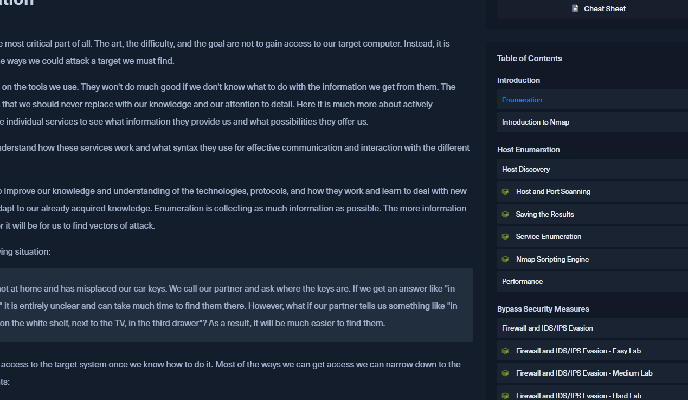

# My HTB CPTS Journey (In Progress)

<figure><figcaption>
A Jedi Holding a Laptop Heading Down a Path Made of Green Cubes - Made with Midjourney
</figcaption></figure>

Welcome to my comprehensive article/journal covering my journey to achieving Hack The Box's Certified Penetration Testing Specialist exam. This is a new certification and educational experience designed by the Academy Team at Hack The Box. I will complete each of the modules in the recommended order as well as some of the recommended boxes in preparation for CPTS. After completing each module Ill share lessons learned all leading up to the actual exam taking process. Ill also be creating YouTube videos as inspiration hits and within Hack The Box's Terms of Service.&#x20;

Some other things Ill be considering in my reflections are: &#x20;

* The Cohesiveness of the Content
* Order in which concepts are presented
* Clarity in Lesson Presentation&#x20;
* Overall Technical Performance (labs, UI elements and challenge questions)&#x20;
* Teaching Effectiveness (how well the content prepares learners for challenge questions and the overall exam at the end of the path)

I will be viewing the content from a student and educator perspective. I'd like to assess the content  for use at the college level to see how it can potentially be integrated into Cybersecurity curriculums. My hope is that as you read this you'll learn a whole lot, build insight and maybe even start your own CPTS journey. Please know this article is more of a study guide and reflection than training content. Lets begin.

### Penetration Testing Process Reflection

<figure><figcaption>
Penetration Testing Process by Cry0l1t3 &#x26; mrb3n
</figcaption></figure>


Link to Penetration Testing Process Module


This is a solid module that served as an overview of the Penetration Testing Process and a sort of orientation to the Penetration Tester job role path. There are some useful navigational tools presented like a **Path Syllabus** that categorizes each module based on how the covered concepts would fit in each phase of a Penetration test. It also lightly defines many common terms that can often get mixed up like Penetration Test, Vulnerability Assessment, Red Team Assessment etc. It gets really detailed further on regarding some of the less popular topics like the important paper work and steps that need to be completed prior to even starting the actual test & getting to hacking. The authors get precise about different types of NDAs, common IT & Security leadership types you'd interact with and good questions to facilitate the initial conversations. A lot of great advice is provided alongside checklists that could be practically applied by anyone going through the process with an organization. Id go so far as to say if you have your own Security firm or are operating as an independent contractor you could use these checklists as a baseline to build off of in interacting with clients.&#x20;

One thing I wish HTB Academy had with this module is a 10 - 20 minute video where there is a sort of acted out scenario that could show learners what Pre-engagement phase interactions may look like. With any all completely online learning resource it can be a challenge to build the inter-personal skills needed in business interactions, those skills normally develop from interacting directly with other people but I really think a video could help with this. Some simple and straightforward challenge questions are used to keep readers on their "toes" as they read through the module. I find this format of having challenge questions to answer really effective at ensuring retention of concepts & learning objectives. I think it can be tempting for anyone to "turn off" their brain while reading and just hurry to the finish. We all have a "**lazy learner**" inside of us somewhere. As an instructor I've struggled to get my students to consistently read material in its entirety. I'm not sure if this is just a reflection of the "**microwave mindset**" age we are in or if more content needs to be in the format that HTB seems to have mastered. What I do know is some degree of challenge has to be involved to really encourage someone to read & retain cause it is not enough to just read something once and be done with it . That said, I did read several sections twice because of the wealth of information provided. I think the authors should create more challenges questions in this module to ensure students are really absorbing everything presented.&#x20;

The module ends with a section called **Practice** that provides a recommended practice plan on how learners can supplement what they learn through HTB Academy modules by writing, completing other HTB content, and practicing communicating in technical & non-technical ways.&#x20;

Overall this was a great start to the path that has me looking forward to the next module.&#x20;

### Getting Started Reflection

<figure><figcaption>
Getting Started by mrb3n &#x26; 21y4d
</figcaption></figure>


Link to Getting Started Module


Getting Started is an excellent module that gets into the technical side of the Penetration Testing process. Most of this module is interactive so you must spawn and hack targets using the concepts & skills taught in each interactive section. The authors did a great job teaching the concepts. As you read, it feels like you are being taught not just reading a technical manual. Each section builds off the next in a cohesive way and the concepts build on one another. Challenges start off easy by gradually increasing in difficulty as you progress through the module before the grand finale **Knowledge Check** section. Mid-way through the module there are four interactive sections that guide the learner through attacking a HTB box called Nibbles.

.png>)

This practically ties together each of the concepts and skills mentioned in the previous sections.  It acts as a guided Knowledge Check before the actual **Knowledge Check.** In the future, the authors may want to consider renaming that **Knowledge Check** section to **Skills Assessment** as is reflected in other modules on the platform. I say this because technically every interactive section could be considered a knowledge check.&#x20;

I use the Getting Started module in many of the college classes I teach. It brings together so many concepts that I see opportunities to integrate it all over the place really. For example, I teach an advanced networking class where we build Windows Domains, configure Cisco Switches & Routers and become familiar with Linux. Part of the class covers common security terminology like **Vulnerabilities** & **Exploits.** Most of the text-books out there just define the terms but I like to connect terminology with practical experiences. That's when Ill have my students create an HTB Academy account and we will go through Getting Started together. It is a great teaching tool. I use the HTB Academy sections as slides and we will do the challenges together. Often Ill stop and have my students try to complete the challenge questions on their own to make sure they are learning and not just copying what I do. It can imagine internal corporate training programs operating in this fashion as well to help upskill employees or try out new TTPs. This also gives me deeper insight into what fundamental IT skills learners need to understand more complex IT topics. I have an unpopular opinion on this that Ill cover now.&#x20;

**What does it mean to be a Beginner?**&#x20;

I've taught thousands of students over the years in IT & Cybersecurity. Most of these students were beginners. In general I believe there are two kinds of beginners when we are talking about Cybersecurity. There are **absolute beginners** and there are **people with IT experience** that want to shift the focus to Cybersecurity-focused job roles. An absolute beginner may have never built a network or configured a domain controller. A beginner with IT experience may have been a sys admin or network admin and is familiar with how many IT systems work but may have never really tried hacking or worked in a Security Operations Center. HTB Academy's curriculum can reach both audiences but for the absolute beginner you may want to start with their [Information Security Foundations ](https://academy.hackthebox.com/path/preview/information-security-foundations)because it covers some of the basics of Windows & Linux Operating Systems, Networking (which is very very very important), Active Directory, Web Applications and more. The reason I went on this text-based rant is because I feel if you are an absolute beginner and you start with the Getting Started module there's going to be some unexpected hurdles. For example, when you start learning about reverse and bind shells you may still be trying to understand what Linux is and even how IP addresses & ports work. Don't feel bad about that! The great thing about hacking is all of us are learning as we go. No one knows everything.

All that said, Getting Started is a great module with lots of hands-on practice for any skill-level to be given a solid challenge and learning experience.&#x20;

## Network Enumeration with NMAP Reflection

<figure><figcaption>
Network Enumeration with Nmap by Cry0l1t3
</figcaption></figure>

Network Enumeration with NMAP is a well designed module with many challenge questions sprinkled throughout that force learners to apply enumeration concepts taught in accompanying sections. I like the way the author challenges the learner to think. If learners are paying attention while reading it generally does not take long to know what must be done to find the flag or answer. That said, it is easy to get caught up in finding the answers being the primary focus. Hack The Box does of course produces challenges that have answers that are addicting to find and submit like beating a boss in a video game. I recommend not limiting your learning experience to just finding the answers. Enjoy the process and focus on learning throughout the journey!&#x20;

I did find myself using the cheat sheet to jog my memory on different commands that can be used. Each module on HTB Academy has a cheat sheet, which is essentially a list of some of the most important commands, options, one liners and payloads mentioned in the module. These are super helpful with module challenges, but also on engagements in real life. There are countless long commands that I just never memorized, so it is helpful to be able to have these premade cheat sheets to quickly reference.

<figure><figcaption>
Viewing &#x26; Downloading a Cheat Sheet on HTB Academy
</figcaption></figure>

You can even download the cheat sheets for offline use. I find this to be a thoughtful feature to include as I've personally seen some books sold on Amazon that essentially act as cheat sheets. It is awesome that they are already included with the cost of a subscription or individual module.&#x20;

There are 3 labs at the end of the module that are focused on using NMAP to evade a firewall and IDS/IPS on the targets. I personally found the narrative-based scenarios to be a bit confusing to understand the purpose of but the challenge itself was a great learning experience (February 2023).

Overall, I recommend this module especially if you are beginner who is new to the concept of enumeration.&#x20;
