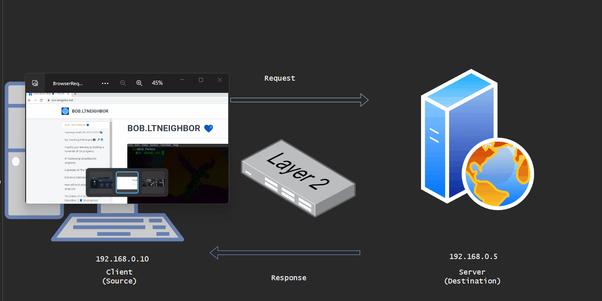

# IP Addressing Simplified

## IP Addressing & Subnetting 

**Why are we doing this? (The Willieverneedthis? Paradigm)**

When it comes to any process involving math many people tend to subscribe to this mindset: “This seems really pointless! Will I ever really use this stuff!?” This mindset makes sense but if you commit to it you can really cripple your ability to learn important concepts. The purpose of IP addressing & Subnetting is not to make your life harder. We aren’t learning this just to fill time. This is a skillset that is fundamental to the success of the Networking Professional. You will even find that the math involved is easy. The hardest part about this whole process is discovering and understanding a method that works for you. In this packet we are going to cover IP addressing concepts and a fantastic Subnetting method that has done wonders for me.

<figure><figcaption>
An Ewok Wondering if He will ever need IP Addressing - Made with Stable Diffusion
</figcaption></figure>

### What is an IP address? 

An Internet Protocol address is a logical identifier for a host (device with a network card) on a network. You should know that an IP address is assigned in software. There are two versions of IP: IPv4 and IPv6. We will be focusing on mastering IPv4 first so don’t expect to see much about IPv6 in this packet. As of the date of this writing IPv4 is the dominant protocol in the Enterprise Local Area Network.

### Internet Protocol version 4 (IPv4) 

IPv4 has been around since the early days of the Internet. A matter of fact this first experimental network was known as the ARPANET (Advanced Research Projects Agency Network) and it was developed by the United States Department of Defense to address data packets for transmission over a physical medium. Yes, you could say the Internet started as a government experiment. This picture below is one of the first Computer Network topologies drawn to represent the Internet (ARPANET).

<figure><figcaption>
The Original ARPA Network
</figcaption></figure>

## IPv4 Structure 

<figure><figcaption>
Packet Structure
</figcaption></figure>

What…… in…… the….. World is all that in that image?!?! This is probably what you are thinking right? Don’t worry you will understand it in due time, for now just follow me. Like many other protocols IPv4 specifies a structure for a message being sent over a network. Let’s say you are composing an email using Microsoft Outlook. You enter the email address of your friend in the To: field, finish your email and hit send. Immediately your’ Operating System and the drivers for your NIC (Network Interface Card) work together to package your message inside an IPv4 packet. The process of packaging the data inside of the packet is known as encapsulation This process is like writing a letter (email) and placing it in an envelope (packet) to be carried to the destination by the postal service. All information that is generated and sent over a network goes through the process of encapsulation (remember the OSI Model!?).

<figure><figcaption>
Client/Server Relationship Illustration
</figcaption></figure>

Each message generated for transmission over a network has a source and destination IP address (like we saw in the addressing structure highlighted in Diagram 1-2). We must also note that the IP address has a specific format. This formatting is called **Dotted Decimal**. Take the IP address **192.168.0.5** for example, this is an IPv4 address and you’ll notice that it is made up of **4 decimal numbers** separated by **4 octets** (spaces between periods). The IPv4 address has 2 portions: Network & Host. The **Network** & **Host** portion of the IPv4 address are critical to understanding how you should apply an addressing scheme to a network. Let’s compare a network to a neighborhood. A neighborhood is a grouping of houses in as part of a town or district and a network is a grouping of computers. Each house in a neighborhood has a specific address that is unique to that house. Each computer in a network has an IP address that is unique to that computer. Please understand that the Network portion of an IP address represents the whole network (neighborhood) therefore every computer that is going to be on the same network should have an IP address that has the same network portion. “Alright great the network portion is important because it summarizes an entire network but what about the host portion you mentioned? Is this like a game show host?” No, it is not at all like a game show host! The host portion of an IP address should be unique to every computer. “How can I tell which portion of the IP address is reserved for the network and which is assignable to hosts?” You know what….. I am so glad you asked! Enter the Subnet Mask.

### [The Subnet Mask](http://www.ltneighbor.net/ipaddressing/ipaddressing#the-subnet-mask) 

An IPv4 address would be useless without the Subnet Mask. The Subnet Mask is an address that defines the network and host portion of an IP address. Check this out:

192.168.0.10 255.255.255.0

Let’s use another metaphor to make sense of this. If an IP address is a phone number for a computer then the Subnet Mask is the area code. In this case, where there is a 255 in the Subnet Mask the number in the corresponding octet in the IP address must match. Where there is a 0 in the Subnet Mask the number in the corresponding octet in the IP address can change and must be different on all devices connected to the network. Using this same example what is the network portion of this IP address? **\_\_\_\_\_\_\_\_**

If you said 192.168.0 is the network portion then you are absolutely……….. Correct!

What is the host portion? **\_\_\_\_\_\_\_\_**\_\_\_

If you said the last octet then you would be correct!

Alright so now we must understand how and why 255 represents the network bits. Here is where that math we talked about earlier comes in. Trust me it’s not rocket science or calculus, its all just 1s and 0s.

### [It’s all just 1s and 0s](http://www.ltneighbor.net/ipaddressing/ipaddressing#its-all-just-1s-and-0s) 

The dotted decimal format of an IP address exists because most humans (even IT people) will not take the time to memorize the binary form of an IP address. We know that in its raw form data is just 1s and 0s. All modern day computers (except quantum computers see: http://www.wired.co.uk/article/quantum-computing-explained) receive a message as a stream of 1s and 0s, this language is known as **\_\_\_\_\_\_**_\_\__.

I feel confident that you answered binary.

Applying this to IP addressing we should know that an IPv4 address (or subnet mask) can only be a maximum of 32 bits in length. Let’s look into this with this subnet mask:

255.255.255.0

11111111.11111111.11111111.00000000

Understanding that the IPv4 address is a maximum of 32 bits in length how many bits is contained per octet? **\_\_\_\_**

If you said 8 bits per octet then you are probably going to be the next Pythagoras! But wait, where does the decimal number 255 or 192 come from?

11111111.11111111.11111111.00000000 = **\_\_\_\_\_\_\_\_** 128 64 32 16 8 4 2 1

IPv4 uses the base 2 numbering system which means every binary digit has a decimal representation. Examining an IPv4 address in its binary form we should note 2 important factors: 1s represent Network bits and 0s represent host bits. Make sense? Cool, this means we add the decimal representation of the 1s to find the decimal number for that octet. What about the 0s? Leave them alone! You do not add the decimal representation of a binary digit that is 0. So what is the dotted decimal translation of the IP address listed above? If you said 255.255.255.0 you are on the right track. If you skipped ahead, found the answer and want to get on with this already, then the rest of this packet will not make a whole lot of sense. Go back and read to understand this before moving on. If you get this let’s continue. Remember that the Subnet Mask specifies the network and host bits of an IP address. Which means that when you compare the binary representation of a Subnet Mask and the binary representation of an IP address you can visualize how a router or NIC (Network Interface Card) decides where to send the message.

11000000.10101000.00000000.00001010 11111111.11111111.11111111.00000000

Comparing the network and host bits of the Subnet Mask and IP address is called ANDing…… and this is how NICs on computers and routers decide whether to send the packet to a PC on its own network or to forward it to the Default Gateway. Wherever the 1s match is what will be the network, wherever the 0s match will be for hosts. It is also critical that you understand that the grandmaster network engineers have established some rules and different classes of IPv4 addresses of which we must be aware.

### [RFC 1918 Private IP address (https://tools.ietf.org/html/rfc1918)](http://www.ltneighbor.net/ipaddressing/ipaddressing#rfc-1918-private-ip-address-httpstoolsietforghtmlrfc1918) 

The IETF (Internet Engineering Task Force) are the grandmasters of the networking world. They develop the protocols and technologies that are used in networking so it’s safe to say they know what they are talking about. Many moons ago they specified a range of IPv4 addresses that should be used on enterprise networks and considered as private. Here is how they are defined:

| Private Class | IP Address Range              |   | Subnet Mask   |
| ------------- | ----------------------------- | - | ------------- |
| Class A       | 10.0.0.0 - 10.255.255.255     |   | 255.0.0.0     |
| Class B       | 172.16.0.0 - 172.31.255.255   |   | 255.255.0.0   |
| Class C       | 192.168.0.0 - 192.168.255.255 |   | 255.255.255.0 |

Great we have all this information about IP addressing and subnetting but what good is it if we don’t know how to use it. Let’s glue these concepts together.

### [IP Addressing Applied](http://www.ltneighbor.net/ipaddressing/ipaddressing#ip-addressing-applied) 

All operating systems that are designed to connect to a network have the option to configure an IP address. In Windows you navigate to the adapter settings to change the IP address statically or set it to be configured dynamically.

<figure><figcaption>
Navigating to Adapter Settings
</figcaption></figure>

<figure><figcaption>
Change Adapter Settings
</figcaption></figure>

<figure><figcaption>
IPv4 Settings
</figcaption></figure>

IP addressing should be considered in your network design and based on host requirements per network or department. The right IP addressing scheme is calculated based on your Subnet Mask because a Subnet Mask gives you the total number of addresses. To calculate this I have a great method to use. Here it is: Host requirement = 54

#### [Step 1. Think in binary!](http://www.ltneighbor.net/ipaddressing/ipaddressing#step-1-think-in-binary) 

* What Subnet Mask would give me close to the host requirement?
* I must consider the magic number (the decimal representation of the last 1 in the Subnet Mask). The Magic Number will also help us find the next network!

#### [Step 2. Find the Magic number (one that gives you at least 54 addresses)](http://www.ltneighbor.net/ipaddressing/ipaddressing#step-2-find-the-magic-number-one-that-gives-you-at-least-54-addresses) 

11111111.11111111.11111111.11000000 128 64 32 16 8 4 2 1

This gives us a total usable range of 62 addresses. Remember you have to accommodate for the network and broadcast address.

#### [Step 3. Find the next network (you can pick any private IP class to start with). We will use](http://www.ltneighbor.net/ipaddressing/ipaddressing#step-3-find-the-next-network-you-can-pick-any-private-ip-class-to-start-with-we-will-use) 

a class C IP address

* We know the 1st network will be 192.168.0.0
* What is the 2nd network? **\_\_\_\_**\_\_\_

If you said 192.168.0.64 then you are correct! How did we get that? THE MAGIC NUMBER! Isn’t it magical?

* Once you have the 2nd network you can determine the usable range within your 1st network

#### [Step 4. Find the range for the 1st network](http://www.ltneighbor.net/ipaddressing/ipaddressing#step-4-find-the-range-for-the-1st-network) 

1st network: 192.168.0.0

2nd network: 192.168.0.64

Usable range for 1st network: 192.168.0.1 – 192.168.0.62

Broadcast for 1st network is 192.168.0.63

#### [Step 5. This is all you need!](http://www.ltneighbor.net/ipaddressing/ipaddressing#step-5-this-is-all-you-need) 

Take some time to practice this method with intentionality. Feel free to use a subnetting calculator to check your work as you go. If you would like some challenge problems, I would be glad to send you some I’ve developed for my students. Have fun!

### Ways to Help & Support

You can help me continue to improve my content through feedback, words of encouragement and even if you:

